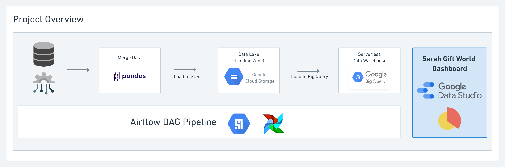
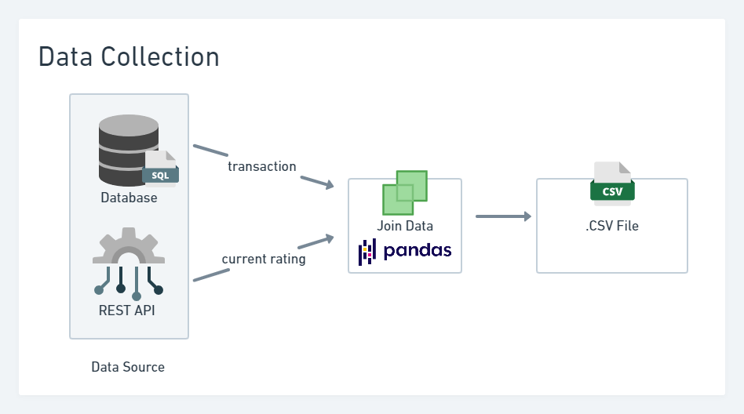
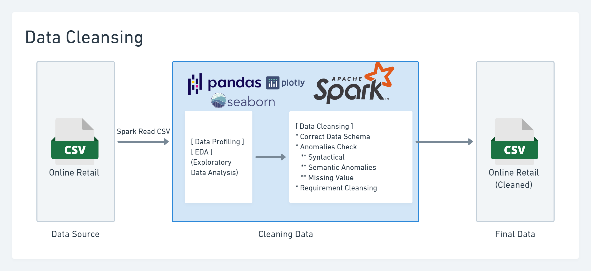
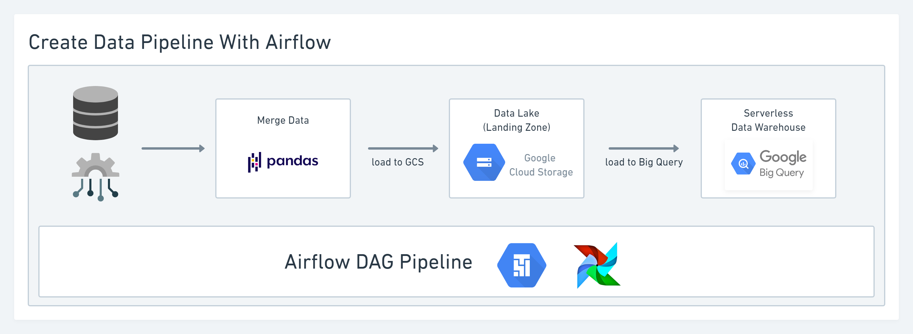

# Project Overview

# Data Collection  &nbsp;&nbsp; [![Open in Colab][Colab Badge]][Data Collection Notebook]

# Upload to Data Lake (Landing Zone)  &nbsp;&nbsp; [![Open in Colab][Colab Badge]][Load Data To GCS Notebook]

# Data Cleansing &nbsp;&nbsp; [![Open in Colab][Colab Badge]][Data Cleansing With Spark Notebook]

# Create Data Pipeline 

[Colab Badge]:          		https://colab.research.google.com/assets/colab-badge.svg  
[Data Collection Notebook]: https://colab.research.google.com/github/anuwatavis/DE-PROJECT/blob/main/Sarah%20Gift%20World/data_collection.ipynb    
[Data Cleansing With Spark Notebook]: https://colab.research.google.com/github/anuwatavis/DE-PROJECT/blob/main/Sarah%20Gift%20World/data_cleansing_with_spark.ipynb  
[Load Data To GCS Notebook]: https://colab.research.google.com/github/anuwatavis/DE-PROJECT/blob/main/Sarah%20Gift%20World/load_data_to_google_cloud_storage.ipynb  
